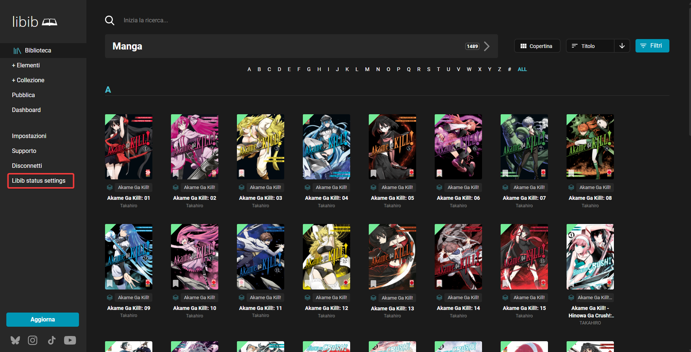
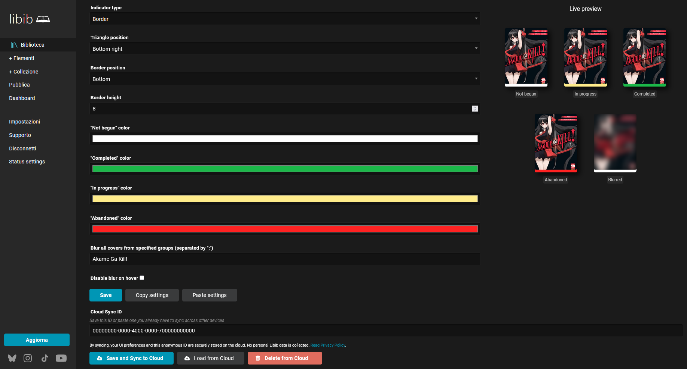
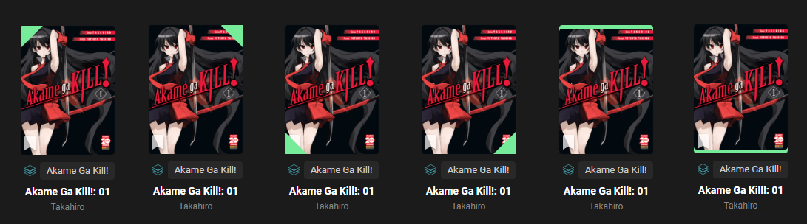
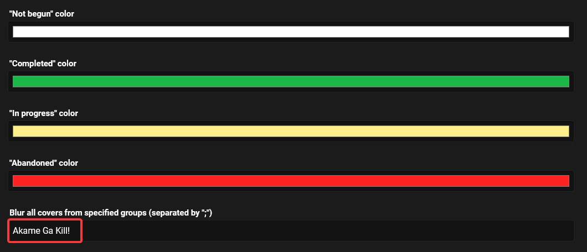
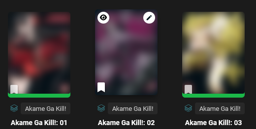

# Libib custom status indicator style

A simple UserScript for customization of Libib.com status indicator

## Why did I make this?

Libib.com is a great website to keep track of your collection of books, CDs and other things.
Unfortunately the status indicator's color selection is not great and this make it hard to see if you already read a book or not.

Here you can see a before and after:\
\

## How to install

1. Install a Userscript Manager like [Violentmonkey](https://violentmonkey.github.io/) or [Tampermonkey](https://www.tampermonkey.net/)
2. Install **Libib - Custom status indicator style** by clicking **[here](https://raw.githubusercontent.com/JetpackCat-IT/libib-custom-status-style/main/Libib-Custom-Status-Style.user.js)**

Mirrors:

## How to use

1. Access your library on [libib.com](https://libib.com/library)
2. You should see a new menu item on the sidebar called **"Libib status settings"**
   
3. After clicking it, a window will open, in this window you can change the settings as you like
   

You can choose between **Triangle** (default) or **Border**, you can also choose the position of the indicator.
If you choose the **Border** style, you can also choose the thickness

Here are all the possible combinations:

In addition, you can also **blur** the cover of specific series (also known as groups).
You can do this in two way:

1. By clicking the **flag** icon on the item cover
   
2. By adding manually the series name in the options
   

Note that this option will blur **the entire series**

If you use this script on multiple computers and want to transfer the settings, you can use the **Copy and Paste settings** buttons at the bottom of the settings page (see image above)
