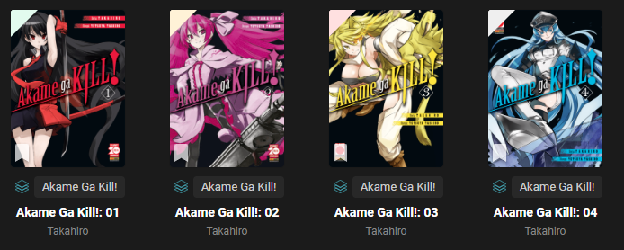
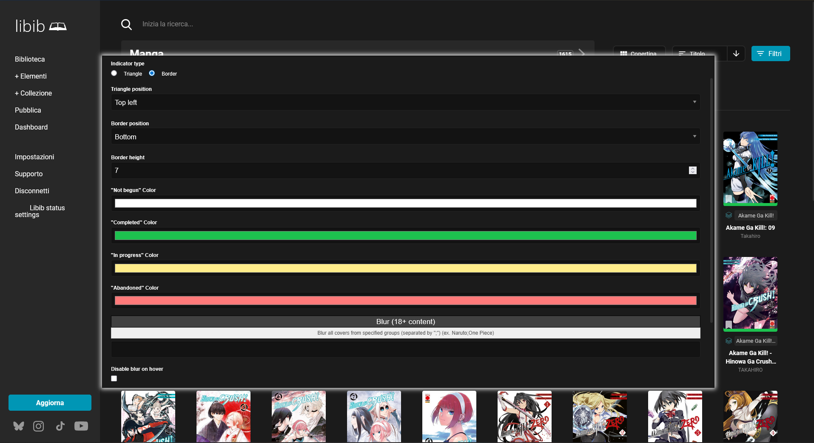

# Libib custom status indicator style

A simple UserScript for customization of Libib.com status indicator

## Why did I make this?

Libib.com is a great website to keep track of your collection of books, CDs and other things.
Unfortunately the status indicator's color selection is not great and this make it hard to see if you already read a book or not.

Here you can see a before and after:\
\

## How to install

1. Install a Userscript Manager like [Tampermonkey](https://www.tampermonkey.net/)
2. Install **Libib - Custom status indicator style** by clicking **[here](../../raw/v1.0.0/Libib-Custom-Status-Style.user.js)**

Mirrors:

## How to use

1. Access your library on [libib.com](https://libib.com/library)
2. You should see a new menu item on the sidebar called **"Libib status settings"**

3. After clicking it, a window will open, in this window you can change the settings as you like

You can choose between **Triangle** (default) or **Border**, you can also choose the position of the indicator.

Here are all the possible combinations:

